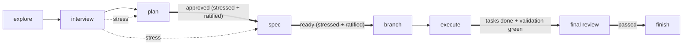
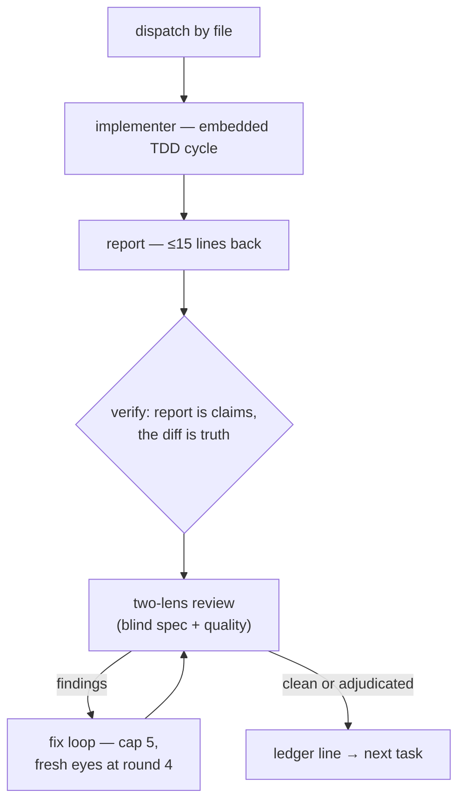

# Noetron

**An intelligent, skill-driven engineering harness for reliable AI-assisted software development — built on loop engineering and graph engineering.**

Noetron understands software engineering requests written in natural language, analyzes the repository, determines the appropriate execution strategy, selects the required skills, builds an execution graph, validates its own work, and adapts when the initial approach is insufficient.

It is **skills-only by design**: no hooks, no daemons, no sentinel files. Everything the harness knows is in `.claude/skills/`, and everything it learns about your project lives in a versioned `noetron/` workspace inside your repository.

## The two foundations

**Loop engineering.** Every unit of work is a node with the same contract: **action + oracle + stop condition**. The oracle is the check that proves the action worked — a machine oracle (test, build, lint, measured output) closes the loop by itself; an attestation oracle (a human judging evidence) pauses for you. The consequence is the harness's central law: **autonomy is a function of oracle strength — never a setting**. To gain autonomy, strengthen the oracle; never loosen the gate.

**Graph engineering.** Skills are nodes; edges are named exactly and gated by oracles; a route and its node are born in the same change, so no edge ever points at a ghost. Write nodes serialize; read-only nodes fan out. When an oracle fails, the remaining subgraph is re-planned from the failed node — never pushed through, never restarted from scratch.

## The execution graph

Chains scale; plans do not. A classifier routes every task by evidence — open decisions, oracle clarity, blast radius — into one of four chains:



| Chain | Evidence | Path |
|---|---|---|
| **Full** | any open material decision (greenfield and structural change are always here) | explore → interview → plan → spec → branch → execute → review → finish |
| **Spec-only** | no open decisions, but multi-step execution needing per-step oracles | explore → spec → branch → execute → review → finish |
| **Direct** | small mechanical change, one surface, obvious oracle | branch → inline micro-plan (`step → verify:`) → execute → verify → finish |
| **Read-only** | conceptual or investigative | explore → answer (no artifacts, no state) |

Two standing guards fire anywhere in the graph: **verify** (no claim of success without fresh evidence) and **interview** (no gap filled by silent default — the LLM never decides alone). Overlays apply to every node in their territory: **design** (UI), **security** (sensitive surfaces), **testing** (all test code), **reasoning** (material uncertainty), **preferences** (the global floor under everything a project keeps), and your project's own **domain skills**.

Inside execution, each task runs the same inner loop:



## The skills

| Skill | Role |
|---|---|
| `noetron-core` | The root: first-use check, invocation contract, oracle and execution doctrines |
| `noetron-setup` | Scaffolds the `noetron/` workspace, anchors CLAUDE.md, checks MCPs, maps domain skills |
| `noetron-create-skill` | Creates domain skills — FRAME → EVIDENCE → DRAFT → VERIFY (trigger test) → REGISTER |
| `noetron-explore` | The facts engine: evidence with `file:line`, never memory |
| `noetron-interview` | The decisions engine: one question per turn, real options, recommendation, synthesis gate |
| `noetron-verify` | The claims gate: IDENTIFY → RUN → READ → COMPARE → CLAIM |
| `noetron-plan` | Chain classifier + the planning loop, ending in an approved, stressed plan |
| `noetron-spec` | Executable specs: bite-sized tasks, full code, exact interfaces, `verify:` on every step |
| `noetron-branch` | Isolation before the first write: protected-branch guard, base discovery, green baseline |
| `noetron-execute` | The loop engine: continuous execution, file handoffs, ledger, fix loops with circuit breaker |
| `noetron-review` | Two independent lenses, severities, pre-report gate, and the discipline of receiving feedback |
| `noetron-debug` | Four-class triage, the red command as entry ticket, the 3-fix architecture rule |
| `noetron-finish` | Destination menu (discard is not on it), merged-result proof, closeout, provenance cleanup |
| `noetron-design` | Direction contract, anti-convergence sortition, numeric craft floor |
| `noetron-security` | OWASP applied to the diff, version-first, before the final review |
| `noetron-testing` | Test-quality doctrine: name the break, exercise the real thing, mutation check |
| `noetron-reasoning` | Technique selection for material uncertainty — evidence in, options out, user decides |
| `noetron-preferences` | The global behavior floor: code/UI hygiene (no emojis), DRY with judgment, production-ready defaults, portability — project preferences override it |
| `noetron-evolve` | The self-improvement loop: weakness mining → minimal proposal → regression validation → ratified adoption |

Every skill ends with a falsifiability footer — *"This skill is working if:"* — with observable signals, so the harness's own maintenance is measurable instead of opinionated.

## The harness improves itself

`noetron-evolve` closes the loop the falsifiability footers open. Every ten completed tasks (or on demand), it **mines weaknesses** from `noetron/history/`, git, and each skill's own working-if signals; **proposes the smallest edits** tied to concrete failures — never a blind refresh; **validates each proposal by regression** (the trigger test, red-green) before you ever see it; and **adopts only what you ratify**. Autonomy in the mining and the validation, the human at the adoption gate: to gain autonomy, strengthen the oracle — never loosen the gate.

## The workspace

Noetron keeps its durable memory in `noetron/` at your repository root:

```
noetron/
├── docs/       # one file per feature, updated by the task that touches it
├── history/    # one file per completed task — the audit trail
├── adr/        # architecture decision records (lean MADR)
├── plans/      # planning outcomes: draft → approved → executed
├── specs/      # executable specs: ready → in-progress → done
├── setup/      # harness configuration: preferences, MCPs, domain skills
└── state.md    # live task state — the crash-recovery point
```

## Installation

1. Clone this repository.
2. Copy **everything except `.git/` and this `README.md`** into the root of the project where you want the harness.
3. Open a conversation (Claude Code; Cursor via the included rule) in that project. Noetron detects the first use and proposes `noetron-setup` — it scaffolds the workspace, anchors `CLAUDE.md` **and** `AGENTS.md` (for Codex and the other tools that read the open agents convention), checks the recommended MCP servers, and maps your domain skills. Nothing is created without your confirmation.

Recommended MCP servers (setup will offer them, you choose the scope): **context7** (live, version-accurate library docs) and **playwright** (real-browser verification of UI work).
